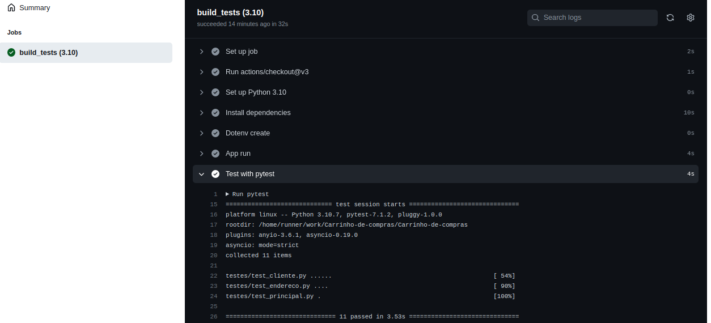

# API Shop Cart

### Projeto Final do treinamento de Python para o < LuizaCode >
Atividade para elaboração de um carrinho de compras com [FastAPI](https://fastapi.tiangolo.com/) e [MongoDB](https://www.mongodb.com/) em que trabalhamos no Bootcamp de Python do Luiza Code.<br><br>

## Objetivo
Criar um projeto Pyton que seja um conjunto de APIs REST para um carrinho de compras (itens decoração), utilizando o
framework FastAPI e que tenha os seus registros salvos no banco de dados MongoDB.
#### As informações que temos no projetos são:
- Clientes: um cliente é a pessoa que está realizando a compra de um ou mais produtos no
nosso sistema.
- Produtos: Produto que o cliente deseja adquirir.
- Carrinho de compras: Informação central do projeto, em que um cliente agrupa um mais
produtos.<br><br>

## Apresentação das atividades
Os épicos estão divididos por funcionalidade. E para o processo de desenvolvimento adotamos a estratégia de branch GitFlow.
### 1 - Criação do ambiente
- Foi considerado o uso da IDE PyCharm para o desenvolvimento.
- Para o gerenciamento das dependências do projeto, foi utilizado a ferramenta `pip`, que tem como target o arquivo [requerimentos.txt](https://github.com/conceicao-peres/Carrinho-de-compras/blob/main/requerimentos.txt), que contém os pacotes Python solicitados e suas versões.
#### Como executar<br>
 > Em IDE diferente do Pycharm:<br>
* Criar venv
    ```bash
    virtualenv venv --python=3.10
    ```
    
    > Ativar venv no Linux
    ```bash
    source venv/bin/activate
    ```
   > Ativar venv no Windows
    ```bash
    .\venv\Scripts\activate
    ```
  <br>
* Instalar requerimentos
     ```bash
     pip install -r requerimentos.txt
     ```
   <br>
* Subir a aplicação
   ```bash
    uvicorn aplicacao:main --factory
    ```
  > No Linux executar:
    ```bash
    bash run.sh
    ```
    <br>
> No Pycharm, seguir apenas os passos de `Instalar requerimentos` e `Subir a aplicação`.

<br>
  
### 2 - Organização da aplicação
- [aplicacao.py](https://github.com/conceicao-peres/Carrinho-de-compras/blob/main/aplicacao.py): Arquivo principal do projeto. Inicia a aplicação.

Organizamos nossa aplicação em módulos e pacotes do Python, onde temos as seguintes pastas:
- [decoracao](https://github.com/conceicao-peres/Carrinho-de-compras/tree/main/decoracao): Pasta principal da aplicação.
  - [modelos](https://github.com/conceicao-peres/Carrinho-de-compras/tree/main/decoracao/modelos): Módulos para declaração de modelos JSON (modelos Pydantic).
  - [persistencia](https://github.com/conceicao-peres/Carrinho-de-compras/tree/main/decoracao/persistencia): Módulo para persistência (repositório) com o banco de dados.
  - [regras](https://github.com/conceicao-peres/Carrinho-de-compras/tree/main/decoracao/regras): Módulos para as regras (casos de uso) da aplicação.
  - [rest](https://github.com/conceicao-peres/Carrinho-de-compras/tree/main/decoracao/rest): Módulos para controle e/ou comunicação com o FastAPI.

Dentro desses diretórios temos os arquivos:
- [modelos_carrinho.py](https://github.com/conceicao-peres/Carrinho-de-compras/blob/main/decoracao/modelos/modelos_carrinho.py): Modelos Pydantic.
- [carrinho_persistencia.py](https://github.com/conceicao-peres/Carrinho-de-compras/blob/main/decoracao/persistencia/carrinho_persistencia.py): Módulo responsável pela comunicação com o banco de dados.
- [carrinho_regras.py](https://github.com/conceicao-peres/Carrinho-de-compras/blob/main/decoracao/regras/carrinho_regras.py): Regras para o cadastro, pesquisa, alterar e deletar.
- [carrinho_rest.py](https://github.com/conceicao-peres/Carrinho-de-compras/blob/main/decoracao/rest/carrinho_rest.py): Rotas para as APIs  (caminho URL "/cart/").
- [rest_conf.py](https://github.com/conceicao-peres/Carrinho-de-compras/blob/main/decoracao/rest/rest_conf.py): Configurações com o FastAPI.
```
├── aplicacao.py
├── decoracao
│   ├── modelos
│   │   ├── __init__.py
│   │   ├── modelos_carrinho.py
│   │   ├── modelos_cliente.py
│   │   ├── modelos_endereco.py
│   │   └── modelos_produtos.py
│   ├── persistencia
│   │   ├── carrinho_persistencia.py
│   │   ├── cliente_persistencia.py
│   │   ├── db.py
│   │   ├── endereco_persistencia.py
│   │   ├── __init__.py
│   │   ├── obter_colecoes.py
│   │   └── produto_persistencia.py
│   ├── regras
│   │   ├── carrinho_regras.py
│   │   ├── cliente_regras.py
│   │   └── __init__.py
│   └── rest
│       ├── carrinho_rest.py
│       ├── cliente_rest.py
│       ├── endereco_rest.py
│       ├── __init__.py
│       ├── produto_rest.py
│       └── rest_conf.py
├── requerimentos.txt
├── run.sh
└── testes
    ├── __init__.py
    ├── test_cliente.py
    └── test_endereco.py

```

### 3 - Conectando no banco de dados
Para realizar esta atividade, escolhemos usar um servico SaaS chamado [Atlas](https://www.mongodb.com/atlas/database), que disponibiliza uma instância do MongoDB para persistir os dados da aplicação.<br><br>
A conexão com o banco é feita atraves do módulo `bd.py`.<br><br>

### 4 - Modelando e ajeitando a camada REST
Com os modelos para entrada e saída do pydantic utilizados pelo FastAPI, editamos o arquivo `carrinho_rest.py` para trabalhar com estes modelos nas funções de criar, pesquisar, alterar e deletar.

#### Requisitos Funcionais:
- **Gerenciamento de Clientes**
    - [x] `Cadastrar um cliente`
    - [x] `Pesquisar um cliente`
    - [x] `Remover um cliente`
    - [x] `Cadastrar um endereço`
    - [x] `Pesquisar um endereço`
    - [x] `Remover um endereço`

 - **Gerenciamento de Produtos**
    - [x] `Cadastrar um produto`
    - [ ] `Atualizar dados de um produto`
    - [x] `Pesquisar um produto pelo código`
    - [x] `Pesquisar um produto pelo nome`
    - [x] `Remover um produto`
   
 - **Gerenciamento de Carrinho de Compras**
    - [x] `Criar um carrinho de compras`
    - [x] `Consultar um carrinho de compras aberto`
    - [ ] `Alterar a quantidade de itens do carrinho`
    - [x] `Remover o carrinho do cliente`
<br><br>
### 5 - Testes unitários

Para os testes unitários, utilizamos a bilioteca [pytest](https://docs.pytest.org/en/7.1.x/)<br>
Os códigos de testes foram centralizados na pasta testes e, dentro desse diretório, um arquivo `test_.py` para cada modelo de gerenciamento de entrada e saida.
* Executar testes unitário
  ```bash
  pytest
  ```
  
  <br>
## Pipeline de Build e Testes
Ao ser criada uma solicitação de PR da `branch/feature` para a `branch Develop`, será excecutado de forma automática os testes unitários que foram implemtados no módulo `testes`


<br><br>
## Documentação OpenAPI
Nativamente o FastAPI já trabalha e gera o documento Swagger, usado para descrever e apresentar as APIs para que possamos testá-las ou utilizá-las em aplicações clientes.
<br><br>
<span style="display:block;text-align:center">

</span>
* Como testar:<br>
Suba a aplicação FastAPI<br>
Acesse a documentação Swagger:
  ```bash
  http://localhost:8000/docs
  ```
